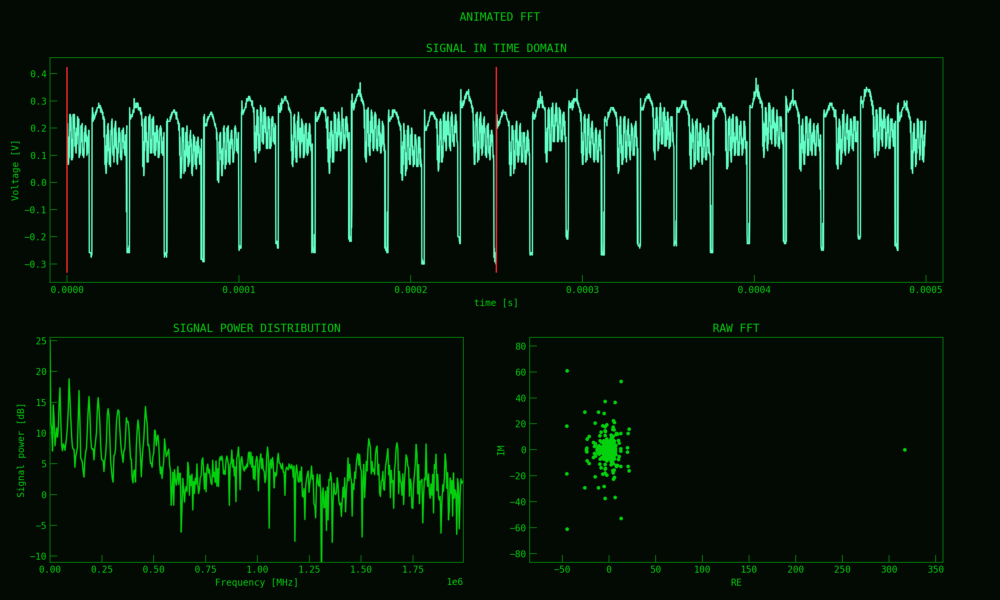

# hardware-helpers
Everything related to signal acquiring and processing, from hardware monitoring devices, like oscilloscopes, DMMs and such

### Project overview

This project consist of several small subpackages, that previously served me for testing connection, data retrieval
and processing from various hardware devices. To connect to them, in project I mainly used SCPI communication 
protocol to send/receive data, or set/interrupt/start various device systems and variables.

##### hp oscilloscope

This subpackage, with the use of RS232 interface, used to communicate to HP54645D oscilloscope. This oscilloscope
has 100MHz bandwidth, with 1MS memory size. Usually this memory size is not accessible out of the box - the version
of oscilloscope i use has an extension module installed on its back, that provides math capabilities 
(integration, derivation, fft of the signal), additional trigger modes (for example - glitch), as well as memory 
extension to up to 1 mega-sample.

`oscilloscope_fft_processing` is somewhat a further extension, offering a possibility to prepare a wavelet transform of
the signal that has been captured by `:DIGITIZE:` command, into a movie that could be uploaded in an easy form somewhere
to show off the results of the capture. I believe it can be used for the data from other oscilloscopes, however the
wavelet transform uses the data from a certain time-window "as is", meaning there is no windowing function applied over
the data that is used for each frame (in other words, a "rectangular window" is used, not Hanning or any other more 
sophisticated one)

Class that is available in this module computes frames one-by-one and dumps them into 
`hp_oscilloscope/rendered_frames/movie1` as a default behaviour. There are 2 binary data files that one can use to 
experiment with the package. The single frames can then be processed by `ffmpeg` executable into a `.mp4` file, with
the desired framerate (that slows or quickens end effect animation). FFMPEG samples are not included in this project,
however i do have an example video, showcasing an end result of this computation and post-processing:

https://www.youtube.com/watch?v=_l9rftIYyKo

sample frame of animation:

##### auxiliary functions

This subpackage has some prototype functions and classes that showcase the methods of how to generate gifs with the
use of matplotlib alone (`mpl_animation_prep.py`). One is based on data substitution, that recalculates entire chart
space based on a new data, the other is just a simple incremental approach.

##### agilent dmm

This subpackage consists of only the single file that showcases the usage of LXI interface for Agilent 34410A. You
can use PyVISA to access the device through USB, however the device also supports connection over the ethernet. For
ethernet connection, refer to user manual on how to connect with this device. You need to have VISA drivers on your 
machine to connect with these devices (one that use LXI). One possible source is either USB that is usually attached
with specific hardware from your vendor (for example: Tektronix RSA306 delivers special version of their VISA drivers),
or you can download them from NI (National Instruments) webpage.

The `dmm_conneciton_test.py` simply aggregates several measurements taken by the device (with the use of SCPI); at 
the end showcasing them on the matplotlib chart.

